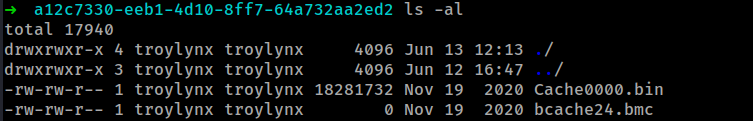
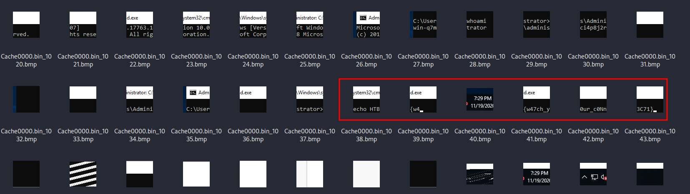

Greetings to y'all, this document is a walkthrough on how i was able to solve the `No Place to Hide` Forensics challenge on `Hackthebox`

## Description
```
We found evidence of a password spray attack against the Domain Controller, and identified a suspicious RDP session.
We'll provide you with our RDP logs and other files.
Can you see what they were up to?
```

## Solution
First of all we are provided a zip file that we are supposed to work with. you can download the zip file clicking on the green button next to the filename.
I downloaded the file and extracted it, now this is what i got 



to understand more about RDP cache forensics you can visit [Ronald Craft](https://medium.com/@ronald.craft/blind-forensics-with-the-rdp-bitmap-cache-16e0c202f91c) blog post or [13cube ](https://www.youtube.com/watch?v=NnEOk5-Dstw&t=9s) Youtube video. 

from the `blog` and `YouTube` video they both made mention of a tool [bmc-tools](https://github.com/ANSSI-FR/bmc-tools) that enables you to extract the `bitmap` images from the `cache` file provide. i downloaded it and used it to extracted the images.

```
~/Documents/bin/python3 /opt/bmc-tools/bmc-tools.py -s ./ -d output
[+++] Processing a directory...
[!!!] File './bcache24.bmc' is zero bytes, skipping file.
[+++] Processing a file: './Cache0000.bin'.
[===] 1162 tiles successfully extracted in the end.
[===] Successfully exported 1162 files.
```

the `-s` means source, or your cache file/directory, `-d` means output directory/location.
i created a folder called `output` to contain all the extracted images. Now you can see it extracted a total of `1162` tiles/bmp images.

Now its time to look through the images and see what actually happened since this is a forensics challenge.



From here we can clearly see the flag.